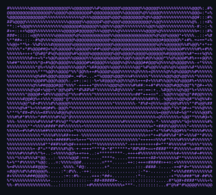

<table>
<tr>
<td width="180" align="center" valign="top">
  
    
  <b>Gusnaldi</b>
   
  @GusnaldiRPH
    
  
</td>
<td valign="top">

  

</td>
</tr>
</table>

---

### 🛠️ Tech Stack

  
  
  
  
  
  
  
  
   
  
  
  
  
  
  
  

---

### 🏆 Stats

  
  
   
  

---

### 📫 Connect

  
  

  

