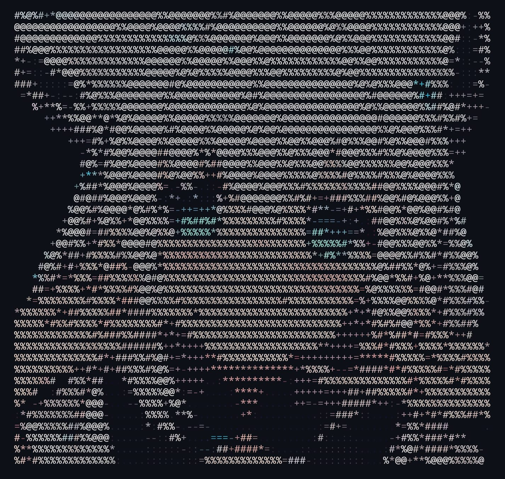
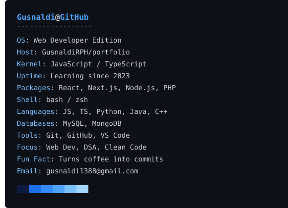

  

 

  

 

<!-- PROFILE -->

  

    

  <h2>Gusnaldi</h2>

  

    @GusnaldiRPH
  

  

 

---

<!-- NEOFETCH -->

  

 

---

<!-- TECH STACK -->

<h2>🛠️ Tech Stack</h2>

  
  
  
  
  
  
  
  

   

  
  
  
  
  
  
  

 

---

<!-- CONNECT -->

<h2>📫 Connect</h2>

  

  

 

  

