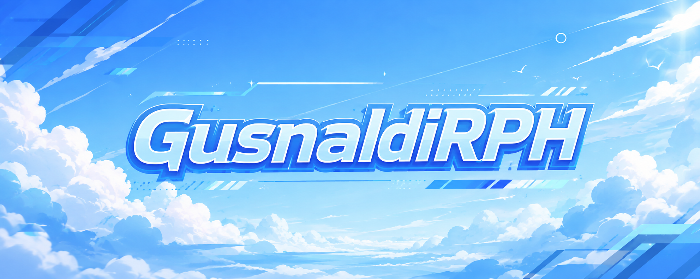
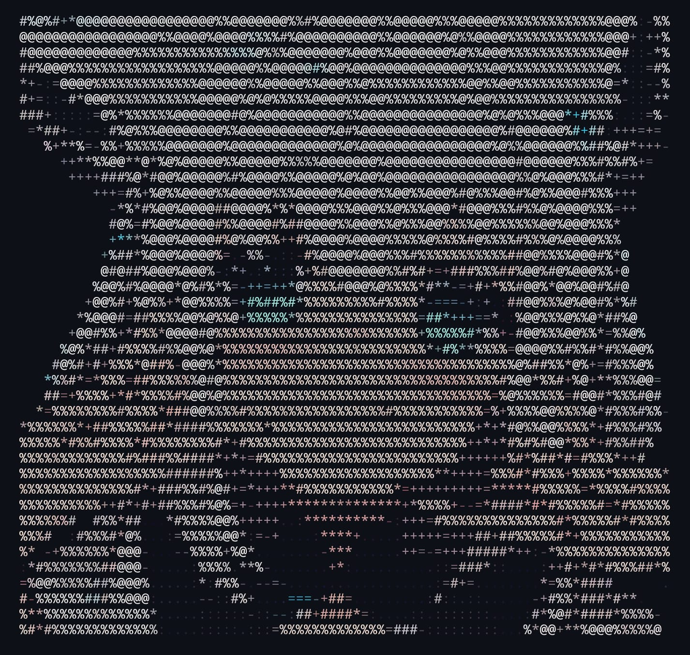
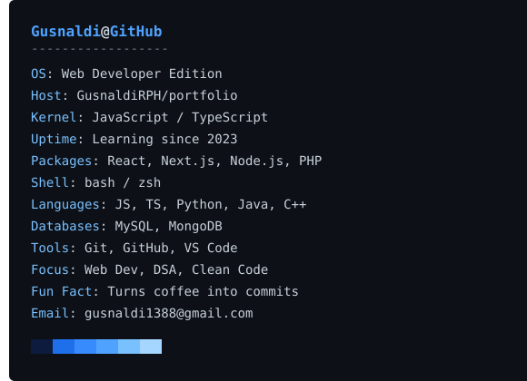

<!-- ========== BANNER ========== -->

  

<!-- ========== TYPING ANIMATION ========== -->

  

 

<!-- ========== PROFILE ========== -->

  

<pre>
 ██████╗ ██╗   ██╗███████╗███╗   ██╗ █████╗ ██╗     ██████╗ ██╗
██╔════╝ ██║   ██║██╔════╝████╗  ██║██╔══██╗██║     ██╔══██╗██║
██║  ███╗██║   ██║███████╗██╔██╗ ██║███████║██║     ██║  ██║██║
██║   ██║██║   ██║╚════██║██║╚██╗██║██╔══██║██║     ██║  ██║██║
╚██████╔╝╚██████╔╝███████║██║ ╚████║██║  ██║███████╗██████╔╝██║
 ╚═════╝  ╚═════╝ ╚══════╝╚═╝  ╚═══╝╚═╝  ╚═╝╚══════╝╚═════╝ ╚═╝
</pre>

  <h3>@GusnaldiRPH</h3>

  

 

<!-- ========== NEOFETCH ========== -->

  

 

---

<!-- ========== ABOUT ========== -->
<h2 align="center">👨‍💻 Tentang Saya</h2>

  Halo, saya <b>Gusnaldi</b> 👋 seorang <b>Full-Stack Developer</b> yang suka 
  membangun aplikasi web dan mobile, dari sisi tampilan sampai server.

  Saya terbiasa bekerja dengan berbagai bahasa dan framework, 
  mulai dari JavaScript/TypeScript, React, Laravel, hingga Python dan C#.

  Saya senang mengubah ide menjadi produk yang berfungsi, rapi, dan nyaman dipakai. 
  Selain coding, saya juga suka mendesain antarmuka menggunakan Figma dan Canva.

---

<!-- ========== TECH STACK ========== -->
<h2 align="center">🛠️ Tech Stack</h2>

                        

 

---

<!-- ========== PROJECT ========== -->
<h2 align="center">🚀 Proyek</h2>

  

  

---

<!-- ========== CONNECT ========== -->
<h2 align="center">📫 Connect</h2>

  
  

 

<!-- ========== VISITOR COUNTER ========== -->

  

<!-- Proudly created with GPRM ( https://gprm.itsvg.in ) -->
